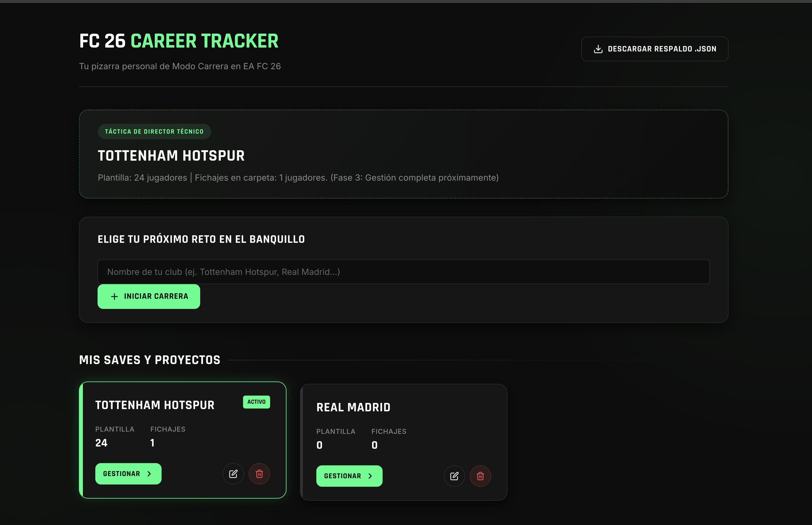
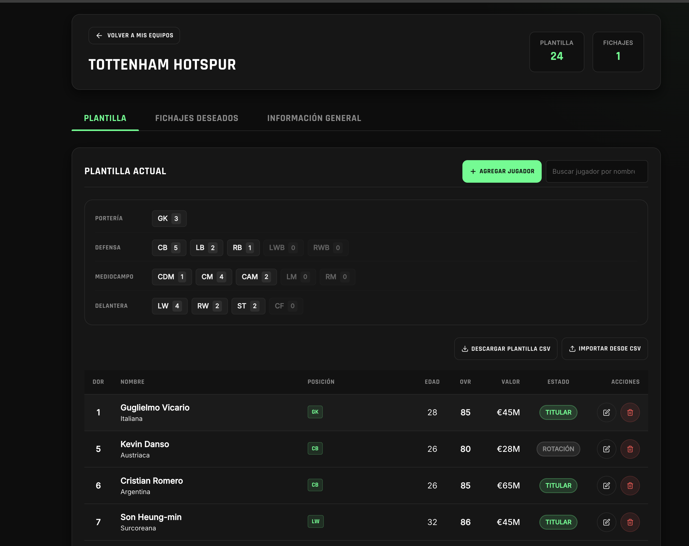
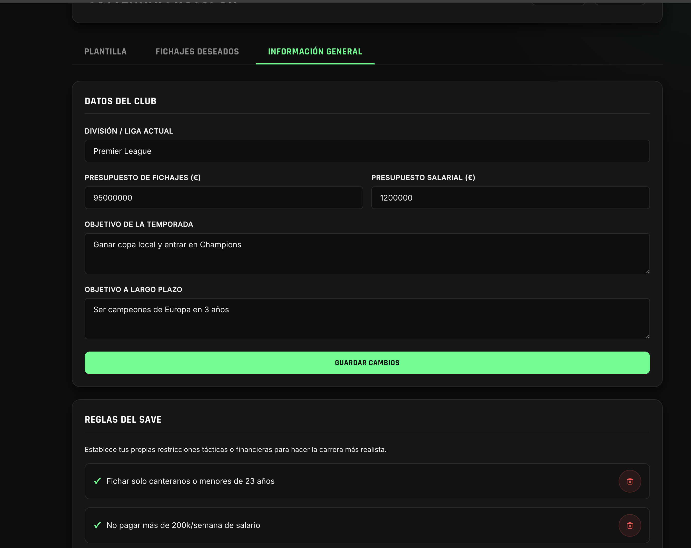

# EA FC 26 Career Tracker

[](https://developer.mozilla.org/es/docs/Web/HTML)
[](https://developer.mozilla.org/es/docs/Web/CSS)
[](https://developer.mozilla.org/es/docs/Web/JavaScript)
[](https://developer.mozilla.org/es/docs/Web/API/Window/localStorage)
[](https://pages.github.com/)

**EA FC 26 Career Tracker** es una aplicación web local-first diseñada para organizar y planificar la información de tus partidas de Modo Carrera en EA FC 26. 

Sustituye las libretas de papel o las notas del móvil por una herramienta ágil, centralizada y visualmente intuitiva, optimizada para usar en PC en una pantalla secundaria o desde el móvil.

---

## Objetivo del Proyecto

Durante las partidas de Modo Carrera, es fácil perder el control de la planificación a largo plazo: distribución de la plantilla, presupuestos, objetivos de la directiva y posibles fichajes. Esta aplicación centraliza toda esa información en una pizarra táctica unificada, sin necesidad de cuentas ni servidores externos.

---

## Características Principales

### Panel de Control (Dashboard)
- **Múltiples Saves**: Crea, edita y elimina distintas carreras de forma independiente.
- **Pizarra Táctica Activa**: Identifica qué equipo estás gestionando actualmente para acceder directamente a su planificación.

### Pestaña: Plantilla (Squad Planner)
- **Gestión de Jugadores**: Registro de atributos clave (OVR, potencial, edad, dorsal, contrato, valor y estado de plantilla).
- **Asignación Multi-Posición**: Permite asignar varias posiciones por jugador (ej. `CB|LB`) usando las nomenclaturas del juego.
- **Resumen por Posición**: Gráfico visual que muestra la distribución de tu equipo (GK, DEF, MED, DEL) para detectar huecos fácilmente.
- **Filtros y Búsqueda**: Buscador en tiempo real y filtrado interactivo haciendo clic en las posiciones del resumen.
- **Importación/Exportación CSV**: Carga o descarga masiva de jugadores desde archivos `.csv`.

### Pestaña: Fichajes Deseados (Shortlist)
- **Lista de Objetivos**: Monitorea tus posibles incorporaciones, su valoración, club actual y valor estimado.
- **Priorización y Estado**: Clasifica prioridades (`Alta`, `Media`, `Baja`) y estados de negociación (`Pendiente`, `En negociación`, `Fichado`, `Descartado`).
- **Buscador y Filtros**: Filtra por prioridad y estado para gestionar tus mercados de fichajes fácilmente.

### Pestaña: Información General (Save Details)
- **Finanzas**: Control de presupuestos de transferencias y salarial.
- **Objetivos**: Registro de metas de la temporada y a largo plazo.
- **Reglas del Save**: Guarda restricciones autoimpuestas (ej. *Límite de extranjeros* o *Límite salarial*) para partidas más retadoras.
- **Bitácora**: Diario cronológico con fecha automática para registrar lesiones clave o resultados históricos.

### Respaldos
- **Copia de Seguridad JSON**: Exporta todo el contenido de la aplicación en un solo archivo `.json`.

---

## Tecnologías y Arquitectura

- **Desarrollo Nativo**: Construido sin frameworks ni librerías externas.
  - **HTML5**: Estructura semántica.
  - **CSS3**: Diseño responsivo y estética oscura inspirada en la interfaz de EA FC (con acentos en verde neón `#00FF87`).
  - **JavaScript (ES6+)**: Lógica de vistas, validaciones e importación/exportación CSV.
- **Almacenamiento Local**: Persistencia directa en el navegador mediante `localStorage`. Los datos no salen de tu ordenador.

---

## Estructura del Proyecto

```text
ea-fc26-career-tracker/
├── index.html          # Interfaz de usuario (Layout, formularios, tablas y modales)
├── css/
│   └── styles.css      # Estilos visuales y diseño adaptativo
├── js/
│   ├── storage.js      # Capa de datos y validación (localStorage)
│   └── app.js          # Control de vistas y lógica de interacción
├── import_test.csv     # Ejemplo para importación de jugadores
└── eafc-26-tracker.md  # Requisitos originales del proyecto
```

---

## Estructura de Datos (JSON)

La información se guarda en `localStorage` bajo la clave `fc26_career_tracker` con el siguiente formato:

```json
{
  "equipos": [
    {
      "id": "equipo_1718800000000_123",
      "nombre": "Tottenham Hotspur",
      "infoGeneral": {
        "objetivoTemporada": "Clasificar a Champions League.",
        "objetivoLargoPlazo": "Desarrollar canteranos.",
        "presupuestoTransferencias": 120000000,
        "presupuestoSalarial": 1500000,
        "divisionLiga": "Premier League",
        "reglasPropias": [
          "Tener al menos 5 jugadores nacionales en la plantilla"
        ],
        "notes": [
          { "fecha": "2026-06-24", "texto": "Victoria 3-1 contra Arsenal." }
        ]
      },
      "plantilla": [
        {
          "id": "jugador_1718800000500_456",
          "nombre": "James Maddison",
          "posiciones": ["CAM"],
          "edad": 28,
          "nacionalidad": "Inglesa",
          "valoracion": 85,
          "potencial": 86,
          "valorMercado": 60000000,
          "estado": "Titular",
          "dorsal": 10,
          "contratoAniosRestantes": 3,
          "notas": "Lanzador principal de faltas."
        }
      ],
      "fichajesDeseados": [
        {
          "id": "fichaje_1718800000900_789",
          "nombre": "Nico Williams",
          "clubActual": "Athletic Club",
          "posiciones": ["LW", "RW"],
          "edad": 23,
          "valoracion": 84,
          "potencial": 89,
          "valorMercadoEstimado": 55000000,
          "prioridad": "Alta",
          "estado": "En negociación",
          "notas": "Suplir a Son a largo plazo."
        }
      ]
    }
  ]
}
```

---

## Importación de Datos (CSV)

### Formato para Plantilla
El archivo `.csv` para la plantilla de jugadores debe llevar estas cabeceras:

```csv
nombre,posiciones,edad,nacionalidad,valoracion,potencial,valorMercado,estado,dorsal,contratoAniosRestantes,notes
```
*Las posiciones múltiples se separan con una barra `|` (ej: `CB|LB`).*

### Formato para Fichajes
El archivo `.csv` para la lista de objetivos debe usar estas cabeceras:

```csv
nombre,clubActual,posiciones,edad,valoracion,potencial,valorMercadoEstimado,prioridad,estado,notas
```

---

## Cómo Empezar a Usar

### En Local
1. Clona el repositorio:
   ```bash
   git clone https://github.com/Carlosnm0802/ea-fc26-career-tracker.git
   ```
2. Accede al directorio:
   ```bash
   cd ea-fc26-career-tracker
   ```
3. Abre el archivo `index.html` en tu navegador, o inicia un servidor local rápido:
   ```bash
   # Opción con Python
   python3 -m http.server 8000
   
   # Opción con Node.js
   npx serve
   ```

### Despliegue
Este proyecto está optimizado para publicarse directamente en **GitHub Pages** desde la sección *Settings > Pages* de tu repositorio.

---

## Autor

Creado por [Carlos Nares](https://github.com/Carlosnm0802) para planificar partidas del Modo Carrera en EA FC 26.

##Capturas de pantalla


